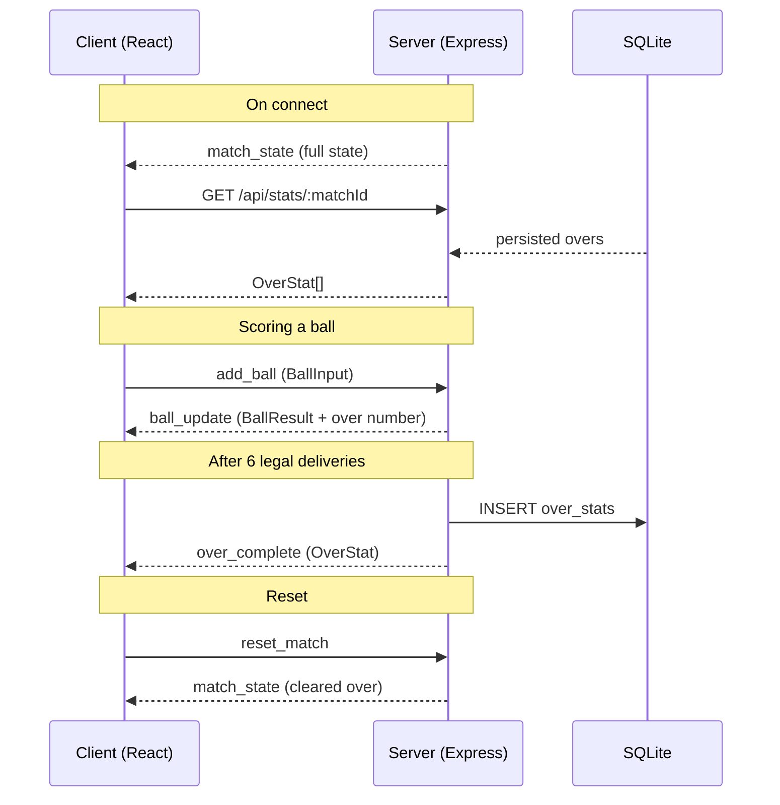

# Cricket Live Dashboard

A real-time cricket scoring dashboard built as a TypeScript monorepo. Two live panels update instantly via WebSocket as balls are bowled.

---

## Architecture Decisions

### Monorepo — npm workspaces + Turborepo

npm workspaces with Turborepo for parallel task execution. Three packages share a single `node_modules`. Turborepo runs `dev` tasks in parallel and caches `build` outputs.

### Shared package — `@cricket-live/shared`

A zero-build internal package consumed by both client and server. Contains all shared TypeScript types (`BallResult`, `OverStat`, `MatchState`, `BallInput`) and `SOCKET_EVENTS` constants — the single source of truth for the client-server contract. Both Vite and tsx resolve it directly from source with no compilation step.

### Real-time — Socket.io

Both panels are driven by Socket.io WebSocket events:

- **Panel 1 (Live Over)** — receives `ball_update` events only. Purely ephemeral; no database involved.
- **Panel 2 (Over Stats)** — receives `over_complete` events when an over finishes. On initial page load it hydrates from `GET /api/stats/:matchId` (one REST call) to show persisted history.

### Database — SQLite via Drizzle ORM

Over statistics have a fixed, well-known schema (over number, runs, wickets, extras, ball-by-ball results). A relational store fits this better than a document store. SQLite requires zero infrastructure — it's a single file. Drizzle ORM is SQL-first with no compilation step; the schema is plain TypeScript and easy to modify. Migrating to PostgreSQL later requires only changing `drizzle.config.ts`.

### Why Drizzle over Prisma

Drizzle is lighter weight, has no schema compilation/generation step, and the schema lives entirely in TypeScript files alongside the application code. It also produces more predictable SQL.

---

## Tech Stack

| Layer     | Technology                    |
| --------- | ----------------------------- |
| Monorepo  | npm workspaces + Turborepo    |
| Shared    | `@cricket-live/shared`        |
| Frontend  | React 18 + Vite + TailwindCSS |
| Backend   | Node.js + Express             |
| Real-time | Socket.io (server + client)   |
| ORM       | Drizzle ORM                   |
| Database  | SQLite (libsql)               |
| Language  | TypeScript (all packages)     |

---

## Project Structure

```
cricket-live-dashboard/
├── package.json              # root — npm workspaces + turbo scripts
├── turbo.json                # Turborepo pipeline config
├── tsconfig.base.json        # shared TypeScript config
├── README.md
├── packages/
│   ├── shared/               # shared types + constants
│   │   └── src/
│   │       ├── types/cricket.ts    # BallResult, OverStat, MatchState, BallInput
│   │       ├── events.ts           # SOCKET_EVENTS constants
│   │       └── index.ts            # re-exports
│   ├── client/               # React app (Vite)
│   │   ├── vite.config.ts    # proxies /api and /socket.io → server
│   │   └── src/
│   │       ├── App.tsx           # layout + socket subscriptions
│   │       ├── socket.ts         # Socket.io client singleton
│   │       └── components/
│   │           ├── LiveOverPanel.tsx   # Panel 1 — ball-by-ball (ephemeral)
│   │           └── OverStatsPanel.tsx  # Panel 2 — over history (persisted)
│   └── server/               # Express + Socket.io
│       ├── drizzle.config.ts
│       └── src/
│           ├── index.ts              # entry point (port 3001)
│           ├── db/
│           │   ├── schema.ts         # Drizzle table definitions
│           │   └── client.ts         # Drizzle + SQLite singleton
│           ├── socket/handlers.ts    # in-memory match state + events
│           └── routes/stats.ts       # GET /api/stats/:matchId
```

---

## Data Flow



---

## Getting Started

### Prerequisites

- Node.js 20+
- npm 10+

### Install

```bash
git clone <repo-url>
cd cricket-live-dashboard
npm install
```

### Development

```bash
npm run dev
```

Turborepo starts both packages in parallel:

- **Server** on `http://localhost:3001` (tsx watch — hot reload)
- **Client** on `http://localhost:5173` (Vite HMR)

Open `http://localhost:5173` in your browser.

### Production build

```bash
npm run build
```

Compiles both packages (Vite for client → `packages/client/dist/`, tsc for server → `packages/server/dist/`). Build outputs are cached by Turborepo — unchanged packages are skipped on subsequent runs.

### Run in production

```bash
# After building, start the server
node packages/server/dist/index.js
```

Serve `packages/client/dist/` via a static file host (nginx, Caddy, etc.) or add a static middleware to the Express server.

### Database

The SQLite database file (`cricket-live-dashboard.db`) is created automatically on first server start — no manual setup needed.

```bash
# Inspect the database via Drizzle Studio
cd packages/server
npx drizzle-kit studio

# Push schema changes to the DB (after editing schema.ts)
npx drizzle-kit push
```

---

## Socket Events Reference

| Event           | Direction       | Payload                              | Description                                 |
| --------------- | --------------- | ------------------------------------ | ------------------------------------------- |
| `match_state`   | server → client | `MatchState`                         | Full state sent on connect                  |
| `ball_update`   | server → client | `{ ball: BallResult, over: number }` | Each new ball (Panel 1)                     |
| `over_complete` | server → client | `OverStat`                           | Over finished, DB already written (Panel 2) |
| `add_ball`      | client → server | `BallInput`                          | Submit a ball result                        |
| `reset_match`   | client → server | —                                    | Clear current over from memory              |

---

## How Scoring Works

1. The **Scorer bar** at the bottom of the dashboard lets you submit ball results.
2. Choose runs (0–6), mark a wicket, or mark it as an extra (wide, no-ball, bye, leg-bye).
3. Click **Add Ball →** — the server receives `add_ball` via Socket.io.
4. The server appends the ball to the in-memory current over and broadcasts `ball_update` to all connected clients.
5. After **6 legal deliveries** (wides and no-balls don't count), the server:
   - Saves the completed over to SQLite via Drizzle.
   - Broadcasts `over_complete` to all clients.
   - Resets the in-memory current over.
6. Panel 1 resets; Panel 2 gains a new row. Persisted rows survive server restarts.

---

## Data Model

```ts
// Ephemeral — in-memory only
type BallResult = {
  ball: number; // 1–6
  runs: number;
  isWicket: boolean;
  isExtra: boolean;
  extraType?: "wide" | "no-ball" | "bye" | "leg-bye";
  description?: string;
};

// Persisted to SQLite
type OverStat = {
  id?: number;
  matchId: string;
  overNumber: number;
  runs: number;
  wickets: number;
  extras: number;
  balls: BallResult[]; // stored as JSON string in DB
};
```
